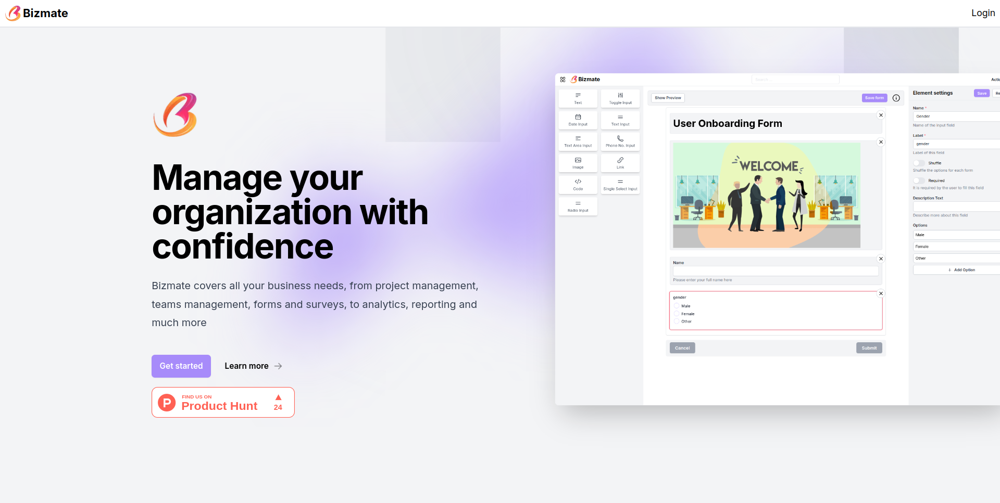

### BizMate

<a href="https://www.producthunt.com/posts/bizmate-2?embed=true&utm_source=badge-featured&utm_medium=badge&utm_souce=badge-bizmate&#0045;2" target="_blank"></a>

BizMate is an open-source business management system that aims to streamline the process of managing businesses with the following key features

- **Independent Workspaces**: Manage multiple business environments with separate workspaces.
- **User Management**: Invite users, assign roles, and set permissions within each workspace.
- **Role-Based Access Control**: Fully customizable roles and permission settings for enhanced security.
- **Forms Management**: Includes a drag-and-drop builder for creating forms, along with analytics and insights for better data management.
- **Upcoming Features**: Currently working on adding a calendar feature to help with scheduling.




#### Tech Stack

- **Frontend**: TypeScript, NextJs, React, HeadlessUI, Tailwindcss
- **Backend**: Golang, GoFiber, AWS
- **Database**: PostgreSQL, SQLC (query-parser and codegen), Goose (database migrations), MongoDB (logs and responses)
- **Others**: Docker, Docker compose, Makefile, Shell, Caddy server, Air (hot-reload)

#### Installation

To get started with BizMate, follow these steps:

**Prerequisites**

- Docker & Docker Compose installed on your machine
- Go, Node.js, and Yarn installed

**Steps**

1. Clone the repository:

```bash
git clone https://github.com/m3rashid/bizMate.git
```

2. Navigate to the project directory:

```bash
cd bizMate
```

3. Build and run the app using Docker Compose:

```bash
docker compose up
```

4. Configuration

```bash
# You can configure the environment variables in the .env file.
# Make sure to set up your database configurations properly depending on your development or production environment.
cp .env.sample .env.local
```

#### Contributions

Feel free to open issues or pull requests to contribute to the project.
